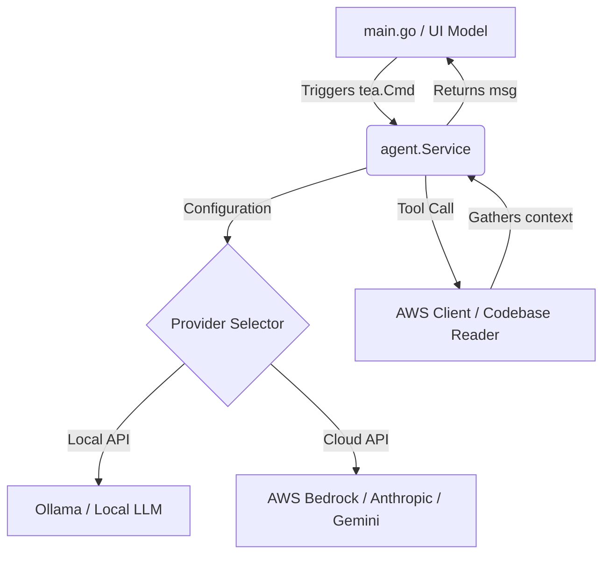

# Specifications for Modern AI Agent in lazyinfra

This document outlines the architectural specifications and design vision for integrating a modern **AI Agent** directly into **lazyinfra**.

## 1. Vision & Core Philosophy

**lazyinfra** is a keyboard-driven AWS Serverless TUI designed for speed and local productivity. Adding an AI Agent should not turn the tool into a bloated chat application. Instead, the AI agent is envisioned as a **context-aware copilot** that reduces daily developer effort by automating diagnostic, search, and configuration tasks directly within the terminal workflow.

### Core Goals
- **Context Awareness**: The agent understands the active view (e.g., the Lambda function being inspected, or the specific CloudWatch log group currently being tailed).
- **Non-blocking Execution**: AI inference runs completely off the main UI thread via asynchronous Bubble Tea commands (`tea.Cmd`).
- **Privacy & Cost Control**: Support for local LLMs (via Ollama) as well as cloud API providers (AWS Bedrock, Anthropic, Gemini, OpenAI).
- **Actionable Outputs**: The agent goes beyond conversation. It generates executable payloads, config patches, and targeted search terms.

---

## 2. Target Features & Capabilities

```
+-------------------------------------------------------------+
| Lambda: my-order-processor                                  |
| Status: Active  | Runtime: go1.x                            |
+------------------------------------+------------------------+
| [Logs Tail]                        | [AI Copilot Pane]      |
| 10:41:02 ERROR: item validation... | Analyzing Error:       |
| 10:41:05 ERROR: invalid order ID   | The validation failed  |
|                                    | due to a missing field |
|                                    | in the JSON payload.   |
|                                    |                        |
|                                    | > [A] Generate Mock    |
|                                    | > [F] Propose Fix      |
+------------------------------------+------------------------+
```

### A. Smart CloudWatch Log Diagnostics
- **Trigger**: The user highlights an error line or exception block in the CloudWatch logs viewer and presses `a` (Analyze).
- **Behavior**: The TUI grabs the surrounding 50 lines of logs, packages them as context, and sends them to the agent.
- **Output**: A side-pane opens containing:
  - A plain-English explanation of the error.
  - A list of likely root causes (e.g., missing IAM policy, database timeout).
  - A suggested code or configuration fix.

### B. Auto-Craft Lambda Payloads
- **Trigger**: The user navigates to the Lambda view, highlights a function, and presses `p` (Payload Wizard).
- **Behavior**: The agent fetches the Lambda's configuration and handler metadata. It prompts the user for the event source type (e.g., SQS, API Gateway, S3) or a natural language description ("SQS order placement event").
- **Output**: The agent generates a valid JSON mock payload, populated with realistic mock data, ready to be copied or directly invoked.

### C. AWS Infrastructure Advisor & Query Chat
- **Trigger**: The user presses `/` to open the CLI command line interface chat.
- **Behavior**: The user types a natural language query about their infrastructure (e.g., "Find which Lambda function is connected to the API Gateway route `/orders`").
- **Output**: The agent inspects the mapped infrastructure list, reasons over the relationship between API Gateway routes and Lambda functions, and responds with the answers and quick navigation commands.

---

## 3. Architecture Overview

### Component Diagram



### Agent Configuration Schema
Configuration will reside in a project-level file (`.lazyinfra.yaml`) or a global user file (`~/.config/lazyinfra/agent.json`):

```json
{
  "agent": {
    "enabled": true,
    "provider": "bedrock", 
    "model": "anthropic.claude-3-haiku-20240307-v1:0",
    "endpoint": "",
    "bedrock": {
      "region": "us-east-1",
      "profile": "default"
    },
    "ollama": {
      "endpoint": "http://localhost:11434",
      "model": "llama3"
    }
  }
}
```

---

## 4. Agent Tools (API for the LLM)

To perform functional analysis, the agent requires a defined interface of **Tools** that it can invoke:

| Tool Name | Arguments | Description |
| :--- | :--- | :--- |
| `GetLambdaDetails` | `functionName string` | Returns code size, variables, handler name, and IAM role name. |
| `FetchRecentLogs` | `logGroup string`, `limit int` | Fetches the latest logs containing specific terms. |
| `DescribeAPIRoutes` | `apiId string` | Returns API Gateway endpoints, route keys, and integrations. |
| `ExplainCodeSnippet` | `filePath string`, `lines []int` | Reads source code context if located in the workspace directory. |

---

## 5. Phase-by-Phase Roadmap

### Phase 1: Engine Wrapper & Configuration (Foundation)
- Create `agent/` package containing client interfaces for Bedrock, Gemini, and Ollama.
- Add configuration loading to standard startup lifecycle.
- Implement basic unit testing of agent prompts.

### Phase 2: Bubble Tea Copilot Overlay (UI)
- Develop `ui/views/copilot.go` displaying a side panel overlay using Lipgloss.
- Wire up async messaging:
  - `tea.Cmd` invokes agent execution.
  - On complete, trigger `AgentResponseMsg` back to Bubble Tea loop.
  - Render responses inside a scrolling viewport.

### Phase 3: Diagnostics Integration (Features)
- Wire up the CloudWatch tail view with keyboard shortcuts (`a` for error analysis).
- Package diagnostic prompts with AWS client calls to fetch active metrics/logs.

### Phase 4: Lambda Payload Generator (Features)
- Wire up the Lambda detail view with a payload wizard (`p`).
- Enable live function invocation inside the TUI using the generated payloads.
